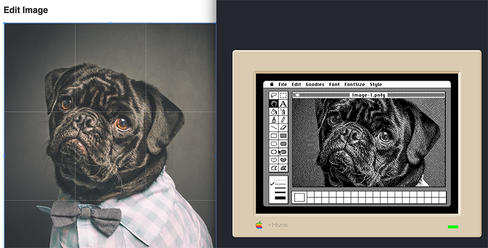

# MFSjs: Read and Write Macintosh File System (MFS) disk images

### 🚀 **[Try out the demo here](https://minorbug.github.io/mfsjs/index.html)** 🚀
#### Experience it now at minorbug.github.io/mfsjs

## What's This All About?

Welcome to MFSjs, a JavaScript library that lets you travel back to 1984 - at least in terms of file systems! This project brings the classic Macintosh File System (MFS) and MacPaint image format to the modern web.

With MFSjs, you can:
- Create and manipulate 400K MFS disk images (just like the original Mac floppies!)
- Convert modern images to authentic MacPaint (PNTG) format
- Package your MacPaint masterpieces into disk images ready for classic Mac emulators

Whether you're a vintage computing enthusiast, a digital preservationist, or just feeling nostalgic for the days of 1-bit graphics, this project has you covered!

### The Macintosh File System (MFS)

When the original Macintosh debuted in January 1984, it introduced MFS - a flat file system designed for 400K single-sided floppy disks. Unlike modern hierarchical file systems, MFS stored all files in a single directory, with folders existing only as a visual metaphor in the Finder.

MFS had several distinctive features:
- Dual-fork files (data fork and resource fork)
- Rich metadata including Type and Creator codes
- 12-bit Allocation Block Map for tracking disk space

While MFS was replaced by the Hierarchical File System (HFS) in 1985, it remains important for vintage computing enthusiasts and emulator users who want to experience authentic early Macintosh software.

### MacPaint

MacPaint, created by Bill Atkinson, was one of the first killer apps for the Macintosh. It showcased the Mac's revolutionary graphical capabilities and mouse-driven interface.

MacPaint images have a fixed format:
- 576 x 720 pixels resolution
- 1-bit monochrome (black and white only)
- Often compressed using the PackBits algorithm

## The LLM-Generated Documentation

This project was created with the help of Large Language Models (LLMs), which generated detailed documentation to guide the implementation. Here's a summary of the key markdown files:

### mfs-js-llm-guide.md

This guide provides instructions for LLMs on how to use the mfs.js library. It covers:

- Core concepts like the `MFSVolume` class and working with `ArrayBuffer`s
- API methods for creating, reading, and writing MFS volumes
- File operations including listing files, reading file content, and writing new files
- Proper handling of MFS metadata like File Type and Creator codes

The guide ensures that LLMs can generate accurate code for interacting with MFS disk images, maintaining the correct byte-level structures required by the format.

### macpaint-doc.md

This technical specification details the MacPaint (PNTG) file format and the algorithms needed to process monochrome images. Key topics include:

- The exact structure of MacPaint files (512-byte header followed by compressed image data)
- PackBits compression/decompression algorithm implementation
- Dithering algorithms for converting modern images to 1-bit monochrome:
  - Simple Thresholding
  - Floyd-Steinberg Dithering
  - Atkinson Dithering (used in the original MacPaint)
  - Bayer (Ordered) Dithering

The document provides the precise technical details needed to faithfully reproduce the MacPaint format and achieve authentic-looking results when converting modern images.

## Getting Started

### Installation

1. Clone or download this repository to your local machine
2. Open the project folder in your web browser
3. No additional installation is required - the application runs entirely in your browser!

### Prerequisites

- A modern web browser (Chrome, Firefox, Safari, or Edge)
- No external dependencies or server setup needed

## Using the Web Application

The MFSjs web application provides an intuitive interface for converting images to MacPaint format and saving them to MFS disk images:

1. **Upload Images**:
   - Drag and drop image files onto the designated area
   - Multiple images can be queued for processing

2. **Edit Each Image**:
   - Select an image from the thumbnail list
   - Use the cropping tool to select the portion of the image you want to convert
   - Toggle the "Constrain to MacPaint Ratio" option to maintain the correct aspect ratio

3. **Choose Dithering Options**:
   - Select a dithering algorithm:
     - Atkinson (authentic classic Mac look)
     - Floyd-Steinberg (smoother gradients)
     - Bayer (ordered pattern)
     - Threshold (high contrast)
   - Adjust algorithm-specific parameters if desired
   - Preview the result in real-time

4. **Configure Disk Settings**:
   - Set the disk size (default 400KB)
   - Name your volume (up to 27 characters)
   - Monitor the disk usage percentage as you add images

5. **Save to Disk Image**:
   - Click "Save to Disk Image..." when you're ready
   - The application will create an MFS disk image containing all your converted MacPaint files
   - Download the .dsk file to your computer

## Testing Your Creation

Once you've created your MFS disk image, you'll want to see it in action! Here's how to test it:

1. Make sure your images appear correctly in the preview panel before saving
2. After downloading the .dsk file, check that the file size makes sense (typically around 400KB)
3. For best results, try images with clear subjects and good contrast

### Recommended Emulator

Visit [http://infinitemac.org](http://infinitemac.org) to test your disk images in an authentic Mac environment. This browser-based emulator lets you experience your MacPaint images on various classic Mac models without installing any software. Simply upload your .dsk file and boot up a virtual Mac to see your images in their natural habitat!

## Conclusion

MFSjs brings a piece of computing history to the modern web, allowing you to create authentic MacPaint images and MFS disk images compatible with classic Macintosh emulators. Whether you're preserving digital artifacts or just having fun with retro computing, we hope you enjoy this blast from the past!

## License

This project is licensed under the MIT License - see the LICENSE file for details.

---
*Created with ♥ for the classic Mac community*