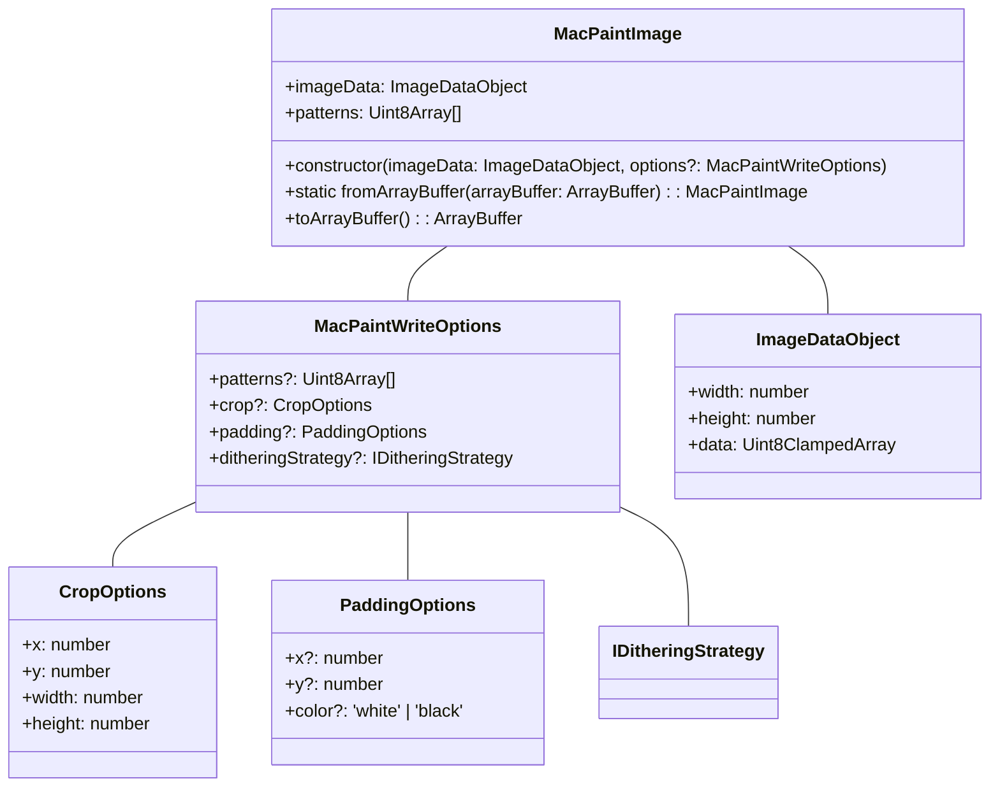

## MacPaint JavaScript Library Development Plan

This plan outlines the structure and development steps for a JavaScript library capable of reading and writing MacPaint (PNTG) files, incorporating flexible image processing options and adhering to SOLID principles for dithering strategies.

### 1. Core Objectives

*   Develop a JavaScript library that can parse MacPaint PNTG files into a usable `ImageData`-like structure.
*   Enable the creation of MacPaint PNTG files from an `ImageData`-like structure.
*   Implement multiple dithering strategies (Threshold, Atkinson, Floyd-Steinberg, Bayer) as interchangeable components (Strategy pattern).
*   Provide options for image cropping, scaling (Bilinear), and padding when converting to the MacPaint format.
*   Ensure compatibility with both modern web browser and Node.js environments.

### 2. Library API Design: `MacPaintImage` Class

The primary interface to the library will be the `MacPaintImage` class.



*   **`ImageDataObject`**: A plain JavaScript object matching the structure of the Web API `ImageData` (`{ width: number, height: number, data: Uint8ClampedArray }`). In Node.js, this can be sourced from `node-canvas` or constructed manually.
*   **`MacPaintImage.fromArrayBuffer(arrayBuffer)` (Static Factory Method)**:
    *   Parses an `ArrayBuffer` containing PNTG file data.
    *   Returns a `MacPaintImage` instance.
    *   The instance will have `this.imageData` populated with the 576x720 monochrome image data (converted to RGBA) and `this.patterns` with the 38 patterns from the file header.
*   **`constructor(imageDataObject: ImageDataObject, options?: MacPaintWriteOptions)`**:
    *   Initializes a `MacPaintImage` instance from an `ImageDataObject`.
    *   `options` control how the image is processed for writing.
    *   Stores the provided `imageDataObject` and processes options for later serialization.
*   **`toArrayBuffer(): ArrayBuffer` (Instance Method)**:
    *   Serializes the `MacPaintImage` instance (including its `imageData` and `patterns`) into a PNTG file format within an `ArrayBuffer`.
    *   This involves the full image processing pipeline (cropping, scaling, padding, dithering).

### 3. Dithering Strategy Design (SOLID)

```mermaid
classDiagram
    <<interface>> IDitheringStrategy
    IDitheringStrategy : +apply(grayscaleData: GrayscaleDataObject, width: number, height: number): OneBitDataObject

    class ThresholdStrategy {
        -thresholdValue: number
        +constructor(options?: { thresholdValue?: number })
        +apply(grayscaleData, width, height)
    }

    class AtkinsonDitheringStrategy {
        +constructor()
        +apply(grayscaleData, width, height)
    }

    class FloydSteinbergDitheringStrategy {
        +constructor()
        +apply(grayscaleData, width, height)
    }

    class BayerDitheringStrategy {
        -matrixSize: 2 | 4 | 8
        -bayerMatrix: number[][]
        +constructor(options?: { matrixSize?: 2 | 4 | 8 })
        +apply(grayscaleData, width, height)
    }

    ThresholdStrategy ..|> IDitheringStrategy
    AtkinsonDitheringStrategy ..|> IDitheringStrategy
    FloydSteinbergDitheringStrategy ..|> IDitheringStrategy
    BayerDitheringStrategy ..|> IDitheringStrategy

    class GrayscaleDataObject{
        +data: Uint8Array  // or Float32Array for precision during error diffusion
        +width: number
        +height: number
    }

    class OneBitDataObject{
        +data: Uint8Array // Packed bits, or a boolean array
        +width: number
        +height: number
    }

    IDitheringStrategy -- GrayscaleDataObject
    IDitheringStrategy -- OneBitDataObject
```

*   **`IDitheringStrategy`**: An interface defining the contract for all dithering algorithms.
    *   `apply(grayscaleData: GrayscaleDataObject, width: number, height: number): OneBitDataObject`: Takes grayscale pixel data and dimensions, returns 1-bit pixel data.
*   **Concrete Strategies**:
    *   `ThresholdStrategy(options?: { thresholdValue?: number })`: Default `thresholdValue = 128`.
    *   `AtkinsonDitheringStrategy()`: Implements Atkinson error diffusion.
    *   `FloydSteinbergDitheringStrategy()`: Implements Floyd-Steinberg error diffusion.
    *   `BayerDitheringStrategy(options?: { matrixSize?: 2 | 4 | 8 })`: Uses pre-defined Bayer matrices. Default `matrixSize = 4`.
*   **Default Strategy**: An instance of `AtkinsonDitheringStrategy` will be used if no strategy is provided in `MacPaintWriteOptions`.

### 4. File Parsing Logic (`MacPaintImage.fromArrayBuffer`)

```mermaid
graph TD
    A[Start: ArrayBuffer Input] --> B{Detect/Skip MacBinary Header?};
    B -- Yes --> C[Advance Offset by 128 bytes];
    B -- No --> D[Offset = 0];
    C --> D;
    D --> E[Read 512-byte App Header];
    E --> F[Extract PNTG Marker (4 bytes)];
    E --> G[Extract 38 Patterns (304 bytes)];
    E --> H[Skip Padding (204 bytes)];
    H --> I[Initialize 576x720 ImageDataObject (RGBA)];
    I --> J[Loop 720 times (for each scanline)];
    J --> K[Decompress PackBits for one scanline (target 72 bytes)];
    K --> L[Convert 72 bytes (576 bits) to RGBA pixels];
    L --> M{All scanlines processed?};
    M -- No --> J;
    M -- Yes --> N[Populate MacPaintImage instance (imageData, patterns)];
    N --> O[End: Return MacPaintImage instance];
```

1.  **Input**: `ArrayBuffer`.
2.  **MacBinary Header Detection**: Check bytes at offsets 0, 1, 65, 69 as per [`macpaint-doc.md#Table 1`](macpaint-doc.md:42). If present, advance data view by 128 bytes.
3.  **Application Header (512 bytes)**:
    *   Read PNTG Marker/Version (4 bytes, expect `0x00000002`).
    *   Read Pattern Data (304 bytes): Store as an array of 38 `Uint8Array`s (8 bytes each).
    *   Skip Padding (204 bytes).
4.  **Compressed Image Data**:
    *   Create an empty `ImageDataObject` for a 576x720 image.
    *   Loop 720 times (for each scanline):
        *   Call `PackBits.decompressScanline()` to get 72 uncompressed bytes.
        *   Iterate through the 72 bytes (576 pixels). For each bit:
            *   '1' (black) -> R=0, G=0, B=0, A=255.
            *   '0' (white) -> R=255, G=255, B=255, A=255.
            *   Populate the `ImageDataObject.data` array.
5.  **Output**: New `MacPaintImage` instance with populated `imageData` and `patterns`.

### 5. File Serialization Logic (`MacPaintImage.prototype.toArrayBuffer`)

```mermaid
graph TD
    A[Start: MacPaintImage instance (sourceImageData, patterns, options)] --> B(Image Preprocessing);
    B --> B1{Crop? (options.crop)};
    B1 -- Yes --> B2[Crop sourceImageData];
    B1 -- No --> B3[Use sourceImageData as is];
    B2 --> B3;
    B3 --> B4{Scale to 576x720? (if dimensions differ)};
    B4 -- Yes --> B5[Scale Image (Bilinear)];
    B4 -- No --> B6[Use image as is];
    B5 --> B6;
    B6 --> B7{Pad to 576x720? (if dimensions smaller)};
    B7 -- Yes --> B8[Pad Image (options.padding)];
    B7 -- No --> B9[Use image as is (now 576x720)];
    B8 --> B9;
    B9 --> C[Convert 576x720 RGBA to Grayscale (Rec. 709)];
    C --> D[Apply Dithering Strategy (options.ditheringStrategy)];
    D --> E[Get 1-bit Monochrome Data (576x720)];
    E --> F[Prepare 512-byte Application Header];
    F -- Default Patterns? --> F1[Use Default Patterns];
    F -- Custom Patterns? --> F2[Use options.patterns];
    F1 --> G;
    F2 --> G;
    G --> H[Initialize Output ArrayBuffer];
    H --> I[Write 512-byte App Header to ArrayBuffer];
    I --> J[Loop 720 times (for each scanline of 1-bit data)];
    J --> K[Pack 576 bits into 72 bytes];
    K --> L[Compress 72-byte scanline using PackBits];
    L --> M[Append compressed scanline to ArrayBuffer];
    M --> N{All scanlines processed?};
    N -- No --> J;
    N -- Yes --> O[End: Return ArrayBuffer];
```

1.  **Image Preprocessing Pipeline**:
    *   **Cropping**: If `options.crop` is provided, extract the specified region from `this.imageData`.
    *   **Scaling**: If the (cropped) image dimensions are not 576x720, scale it to 576x720 using Bilinear interpolation. This will be handled by an `ImageUtils.scaleBilinear` helper.
    *   **Padding**: If the (cropped and scaled) image is smaller than 576x720, place it onto a 576x720 canvas according to `options.padding.x, options.padding.y` and fill the remaining area with `options.padding.color` (default 'white').
    *   **Grayscale Conversion**: Convert the 576x720 RGBA `ImageDataObject` to an internal grayscale representation (e.g., `GrayscaleDataObject` with `Uint8Array` data) using the Rec. 709 luma formula.
    *   **Monochrome Conversion**: Apply the selected `IDitheringStrategy` (default `AtkinsonDitheringStrategy`) to the grayscale data. This yields a 1-bit representation of the 576x720 image.
2.  **Application Header (512 bytes)**:
    *   Write PNTG Marker (`0x00000002`).
    *   Write Pattern Data: Use `options.patterns` if provided, otherwise use a predefined default set of 38 patterns.
    *   Write Padding (204 zero bytes).
3.  **Image Data**:
    *   Loop 720 times (for each scanline of the 1-bit monochrome data):
        *   Pack the 576 bits of the current scanline into 72 bytes (MSB = leftmost pixel; '1' = black, '0' = white).
        *   Compress these 72 bytes using `PackBits.compressScanline()`.
        *   Append the variable-length compressed data to the output `ArrayBuffer`.
4.  **Output**: `ArrayBuffer` containing the complete PNTG file.

### 6. Helper Modules/Functions

*   **`PackBits` Module**:
    *   `decompressScanline(inputView: DataView, offset: number): { data: Uint8Array, bytesRead: number }`: Decompresses one scanline, ensuring 72 bytes output.
    *   `compressScanline(scanlineData: Uint8Array): Uint8Array`: Compresses a 72-byte scanline.
*   **`ImageUtils` Module**:
    *   `crop(imageData: ImageDataObject, cropOpts: CropOptions): ImageDataObject`
    *   `scaleBilinear(imageData: ImageDataObject, targetWidth: number, targetHeight: number): ImageDataObject`: For Node.js, this might leverage `node-canvas` or implement Bilinear scaling. For browsers, a temporary canvas can be used.
    *   `pad(imageData: ImageDataObject, padOpts: PaddingOptions, targetWidth: number, targetHeight: number): ImageDataObject`
    *   `toGrayscale(imageData: ImageDataObject): GrayscaleDataObject`
    *   `createImageDataObject(width: number, height: number, data?: Uint8ClampedArray): ImageDataObject`: Utility for creating `ImageData`-like objects.
*   **`DefaultPatterns`**: An array of 38 `Uint8Array`s representing a simple default MacPaint pattern set.

### 7. Environment Compatibility (Node.js & Browser)

*   **Binary Data**: Use `ArrayBuffer` and `Uint8Array` / `Uint8ClampedArray` / `DataView`.
*   **`ImageData` Handling**:
    *   Browser: Native `ImageData` can be used directly or converted to the plain `ImageDataObject`.
    *   Node.js: Expect an `ImageDataObject` as input. If `node-canvas` is a dependency, its `ImageData` is compatible.
*   **Module System**: Use ES Modules (ESM) for modern compatibility, potentially with a build step for CommonJS if broad Node.js legacy support is needed (though ESM is preferred).
*   **Scaling**:
    *   Browser: Use a temporary `<canvas>` element and its 2D context's `drawImage()` for scaling.
    *   Node.js: If `node-canvas` is a dependency, use its canvas for scaling. Otherwise, a manual Bilinear scaling implementation for `ImageDataObject`s would be needed. Given the user's preference for `node-canvas` as a source, leveraging it for scaling is a good option.

### 8. Error Handling

*   Invalid file format (e.g., too short, missing PNTG marker).
*   Corrupted PackBits data (e.g., decompressor doesn't yield 72 bytes).
*   Invalid input `ImageData` or options.
*   Throw descriptive errors.

### 9. Development Phases (High-Level)

1.  **Core Structure**: Setup `MacPaintImage` class, `IDitheringStrategy` interface.
2.  **PackBits Implementation**: `compressScanline`, `decompressScanline`. Thoroughly test.
3.  **File Parsing**: Implement `MacPaintImage.fromArrayBuffer` (without patterns first, then add pattern parsing).
4.  **Basic Serialization**: Implement `MacPaintImage.prototype.toArrayBuffer` with only Threshold dithering and no cropping/scaling/padding.
5.  **Dithering Strategies**: Implement all `IDitheringStrategy` classes.
6.  **Image Preprocessing**: Implement `ImageUtils` for `toGrayscale`, `crop`, `scaleBilinear`, `pad`.
7.  **Integrate Preprocessing & Options**: Fully integrate options into `toArrayBuffer`.
8.  **Pattern Handling**: Implement default patterns and custom pattern usage.
9.  **Environment Testing**: Test thoroughly in a browser and Node.js.
10. **Documentation**: API documentation, usage examples.